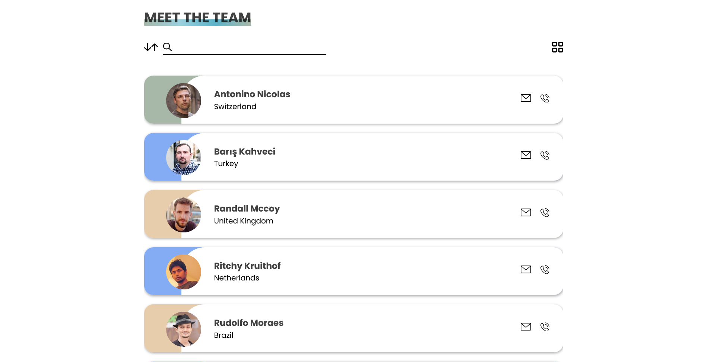

# Profile Fetcher with Layout Toggler

This is a project that seeks to test the following to properly effect my learning :
 1. Balanced use of vanilla Css and or other library (tailwind, material ui)
 2. Use of React Js 
 3. React router 6 {Routes,Route,Outlet,Navlink}
 4. use of Context {context creation and consumption}
 5. Proper Component flow and structuring
 6. Use of Api and data display
 7. use Effect hooks and the axios package
 8. other minor details .
 9. Responsive design {Desktop first}

## Table of contents

- [Overview](#overview)
  - [The challenge](#the-challenge)
  - [Screenshot](#screenshot)
  - [Links](#links)
- [My process](#my-process)
  - [Built with](#built-with)
  - [What I learned](#what-i-learned)
  - [Continued development](#continued-development)
  - [Useful resources](#useful-resources)
- [Author](#author)
- [Acknowledgments](#acknowledgments)

## Overview

### The challenge

Users should be able to:

- View the optimal layout for the site depending on their device's screen size
- See hover states for all interactive elements on the page
- Toggle layout between views
- see a proper page render on toggle view
- Search for a profile based on name
- Sort displayed data in ascending order

### Screenshot



### Links

- Solution URL: [Add solution URL here](https://your-solution-url.com)
- Live Site URL: [Add live site URL here](https://your-live-site-url.com)

## My process

### Built with

- Semantic HTML5 markup
- CSS custom properties
- Flexbox
- CSS Grid
- Desktop-first workflow
- [React](https://reactjs.org/) - JS library
- Axios
- Random Data Api.

### What I learned

 where to start 🤔, the major milestones have been documented at the top of this readMe file, its basically those listed items,but in no partivular order.

```js
export const UserContext = createContext()
export function UserProvider({children}) {
  const [values,setValues] = useState(null || [])
  useEffect(()=>{
    async function users(url){
         const data = await axios.get(url)
         const res = await data.data.results
         setTeam(res)
    }
    users()
 },[search])
  return (
    <UserContext.Provider value={values}>
        {children}
    </UserContext.Provider>
  )
}
```
### Continued development

For continued development, i still think useReducer can be added to this project. Maybe a form to add items or new contacts to the list, that way further working on the project creates more tasks.

### Useful resources

- [React Router](https://reactrouter.com/docs/en/v6/getting-started/installation) - This reference was helpful on getting started with the updated router 6 and new concept.


## Author

- Website - [Ndulue Paschal](https://chukwu.netlify.app/)
- Frontend Mentor - [@Haybuka](https://www.frontendmentor.io/profile/Haybuka)
- Twitter - [@haybukarh](https://twitter.com/haybukarh)

**Note: Delete this note and add/remove/edit lines above based on what links you'd like to share.**

## Acknowledgments

I want to thank myself for not giving up (funny right?, but yea, it was not easy taking up a project of this size), and also friends who have helped to point out some design flaws.

This project was bootstrapped with [Create React App](https://github.com/facebook/create-react-app).

## Available Scripts

In the project directory, you can run:

### `npm start`
